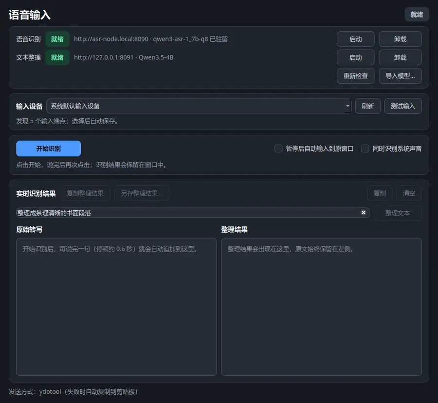
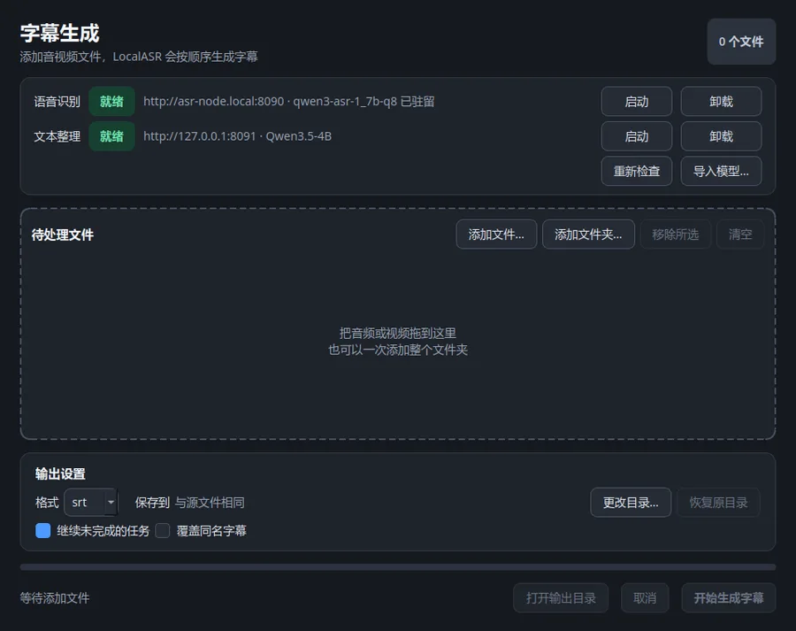
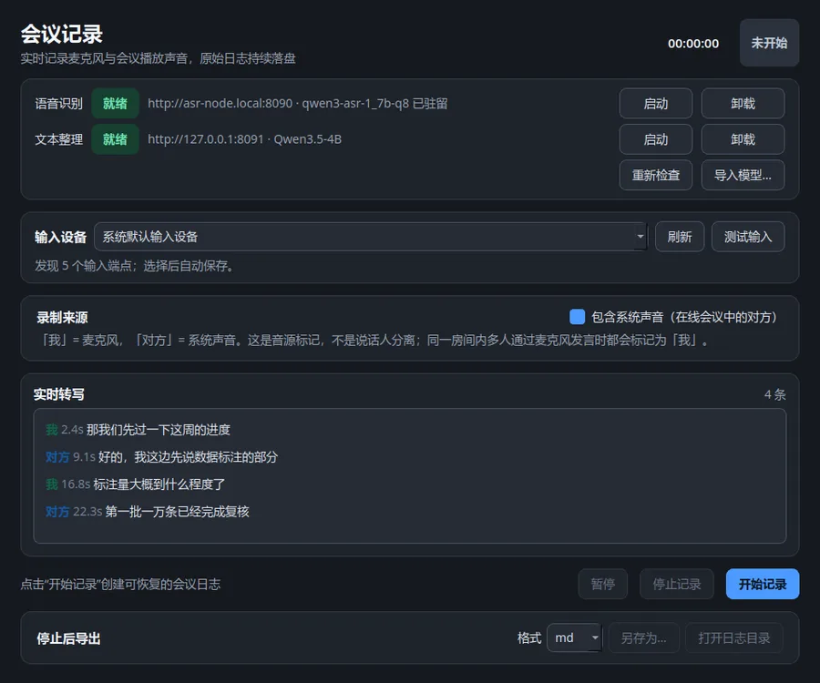

# LocalASR

Speech recognition that runs entirely on hardware you own. Three applications over one
pipeline: **subtitles**, **dictation**, and **meeting notes**.

Nothing is sent anywhere. Recognition runs on a local llama.cpp server; optional
tidy-up of the transcript runs on a second one. Both are reached over the OpenAI audio
and chat APIs, so either can be moved to another machine — or replaced with something
else that speaks the same protocol — by changing a URL.

> The interface is in Chinese, and the default model is tuned for Mandarin
> (Qwen3-ASR also covers 30 languages and 22 Chinese dialects). This README is in
> English; the UI is not.

<p align="center">
  
</p>

---

## Why it is shaped like this

Two decisions drive everything else.

**The engine boundary is a protocol, not a plugin interface.** Every runtime worth using
— llama-server, LM Studio, whisper.cpp's server — already speaks
`/v1/audio/transcriptions` and `/v1/chat/completions`. Writing an adapter layer per
backend would have re-implemented that agreement badly. So there is one HTTP client and
one process supervisor, and swapping models or machines is configuration.

**A tidied transcript is a proposal, not a correction.** Language models drop words,
"fix" product names and invent plausible numbers. The original transcript is kept and
shown beside the refined one, and every refinement is checked against it locally before
anyone sees it — see [Fidelity](#fidelity), which is the part of this project that took
the most care.

## Architecture

```mermaid
flowchart TB
    subgraph apps["Applications — one pipeline, three assemblies"]
        SUB["Subtitles<br/><i>files → SRT/VTT</i>"]
        DIC["Dictation<br/><i>push-to-talk → cursor</i>"]
        MEE["Meeting<br/><i>mic + system audio → journal</i>"]
    end

    subgraph pipe["Pipeline"]
        direction LR
        SRC["source"] --> VAD["silero-VAD<br/>segmentation"]
        VAD --> QUE["segment queue"]
        QUE --> CLI["transcription<br/>client"]
        CLI --> POST["hallucination filter<br/>· line breaking"]
    end

    subgraph check["Before anything is shown"]
        FID["fidelity validator<br/><i>subsequence proof · risk screen</i>"]
    end

    apps --> pipe
    POST --> SINK["SRT · VTT · JSON · Markdown · cursor"]
    POST -. "on request" .-> FID
    FID --> PANE["two panes:<br/>original + refined"]

    CLI == "OpenAI audio API<br/>/v1/audio/transcriptions" ==> NODE
    FID == "OpenAI chat API<br/>/v1/chat/completions" ==> REF

    subgraph backends["Model services — separate processes, separate lifetimes"]
        NODE["<b>ASR node</b><br/>llama-server + Qwen3-ASR-1.7B<br/><i>any host on the LAN</i>"]
        REF["<b>Refiner host</b><br/>llama-server + Qwen3.5-4B<br/><i>localhost or elsewhere</i>"]
    end

    style backends fill:#0d2b45,stroke:#1558a0
    style check fill:#14331f,stroke:#126344
```



Neither model lives inside the application. The refiner is a separate process the app
spawns and terminates (`localasr-refiner`); the ASR node is a service whose **model
residency** follows the session, because there is no remote process to spawn and the
model is what costs — 2881 MiB of it, against 42–61 MiB for the service itself, measured
on a Jetson Orin Nano.

## Fidelity

Conservative cleaning — punctuation and filler removal — has a property that can be
checked rather than hoped for: the output, with punctuation stripped, must be a
**subsequence** of the input. That single test rules out every insertion and every
substitution at once, which is exactly the class of failure that matters.

Custom instructions ("summarise this", "turn it into a task list") reorder and rewrite by
design, so the subsequence check cannot apply. What remains is a **risk screen**:
comparing sets of numbers, negations and identifiers. It catches careless corruption; it
does not certify meaning. The interface says which guarantee is in force, and a
refinement that fails is never shown — the pane keeps the original and states why.

| | conservative | custom instruction |
|---|---|---|
| invented number / negation / identifier | error | error |
| lost number / negation / identifier | error | warning |
| anything not a subsequence | error | not applicable |
| over-deletion (< 40% retained) | error | not applicable |

The known gap is documented rather than papered over: deletion of a meaningful word
inside the retention floor passes. That is why both panes are shown instead of one.

## Applications

<table>
<tr><td width="50%">

**Subtitles** — drag in audio or video, get SRT/VTT/JSON. Segment-level timing comes free
from the VAD, which is what SRT wants anyway. Long jobs resume after an interruption.

</td><td width="50%">

**Meeting notes** — microphone and system audio on one timeline, labelled by capture
source. That is free two-party separation for online meetings, and honestly *not*
speaker diarisation: two people in one room both read as "me".

</td></tr>
<tr><td></td>
<td></td></tr>
</table>

## Install

Requires Python ≥ 3.11, [uv](https://github.com/astral-sh/uv), ffmpeg, and a llama.cpp
build (`llama-server`). Verified against build `b10333`.

```bash
git clone https://github.com/BMProjects/LocalASR.git && cd LocalASR
uv sync --extra gui

uv run localasr doctor            # says what each application is missing, with fixes
uv run localasr models pull qwen3-asr-1_7b-q8
uv run localasr install-desktop   # menu launchers for the three applications
```

Text injection on Wayland needs `ydotool` and its daemon; without it the clipboard is
used as a fallback. `localasr doctor` explains this per application rather than in the
abstract.

### Using a model you already have

Weights managed by another tool — LM Studio, an existing Hugging Face cache — can be
linked instead of copied:

```bash
uv run localasr models import ~/path/to/model.gguf --kind llm --link
```

`--link` keeps a single copy on disk. Removing the import unlinks it and never touches
the original.

## Running

```bash
uv run localasr subtitle recording.mp4 -o recording.srt
uv run localasr meeting --output notes.md --export md
uv run localasr dictate --seconds 10 --no-deliver   # one-shot, prints instead of typing
uv run localasr-desktop dictation                   # or subtitle / meeting
```

### Configuration

Bind `localasr-desktop dictation` to a keyboard shortcut for hands-free access: the
single-instance socket hands the request to a host that is already running rather than
starting a second one.

`~/.config/localasr/config.toml`. Only what differs from the defaults is written.

```toml
node_url    = "http://asr-node.local:8090"   # audio; omit to run ASR locally
refiner_url = "http://127.0.0.1:1234"        # text; omit and the app runs its own
local_asr_fallback = false
```

An external refiner is normally read-only from the application — a URL is not a process.
LM Studio is the exception: it exposes model residency through `/api/v1/models/{load,
unload}`, so the load and unload controls keep working against it, and the model is
handed back when the window closes. It is detected, not configured.

Splitting the two backends across machines is a deployment choice, not a mode — see
[deploy/README-node.md](deploy/README-node.md), which also carries the measured numbers
for a Jetson Orin Nano + RTX 3050 pair (1.82 s end to end, warm, against ~66 s when one
board had to swap models between roles).

## Development

```bash
uv run pytest        # 572 tests, no GPU and no model weights required
uv run ruff check .
```

Tests deliberately avoid the weights: a unit run that needs a 2.8 GB download is a unit
run nobody does.

## Acknowledgements

This is an assembly of other people's work far more than it is original:

- **[llama.cpp](https://github.com/ggml-org/llama.cpp)** — the runtime everything here
  talks to, and the reason a 1.7B audio model fits on a laptop GPU at all.
- **[Qwen3-ASR](https://huggingface.co/Qwen)** (Alibaba Qwen team) — the recognition
  model, and **Qwen3.5** for refinement.
- **[ggml-org](https://huggingface.co/ggml-org)** — the official Qwen3-ASR GGUF
  conversions.
- **[Unsloth](https://huggingface.co/unsloth)** — quantisations that made a 4B refiner
  fit beside everything else.
- **[Silero VAD](https://github.com/snakers4/silero-vad)** — segmentation, which is also
  where the subtitle timing comes from.
- **openasr** — for the argument that the useful boundary is an OpenAI-compatible
  server rather than a per-backend adapter layer, which is the decision this project is
  built on.
- **[FireRedASR](https://github.com/FireRedTeam/FireRedASR2S)** — evaluated as an
  alternative; the comparison shaped the model choice here.
- [PySide6/Qt](https://www.qt.io/qt-for-python), [soxr](https://github.com/dofuuz/python-soxr),
  [onnxruntime](https://onnxruntime.ai/), [httpx](https://www.python-httpx.org/),
  [Typer](https://typer.tiangolo.com/), [FastAPI](https://fastapi.tiangolo.com/),
  [uv](https://github.com/astral-sh/uv), and [ydotool](https://github.com/ReimuNotMoe/ydotool).

## License

[MIT](LICENSE). Model weights are not covered by it — each carries its own licence from
its publisher, and those are the terms that govern what you may do with the models
themselves.
